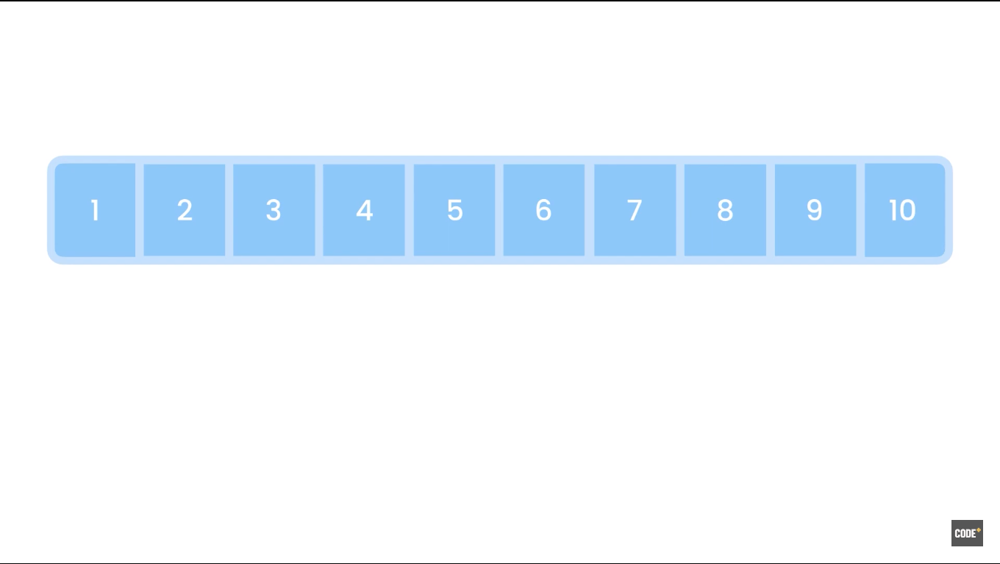
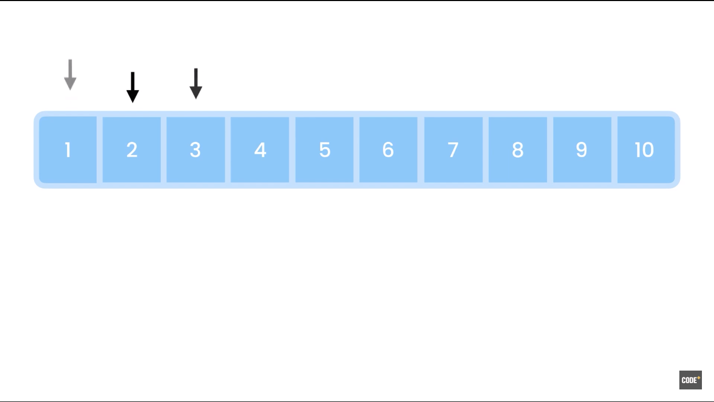
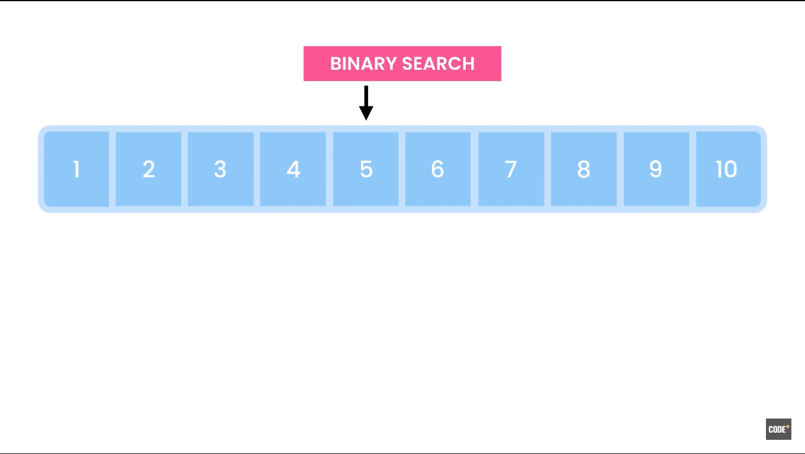
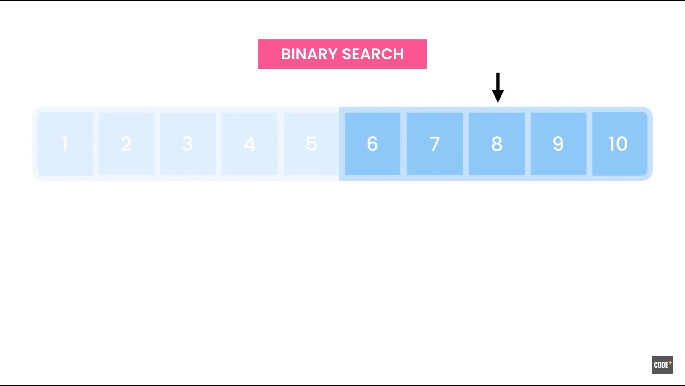
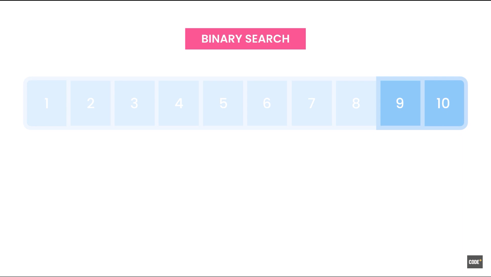
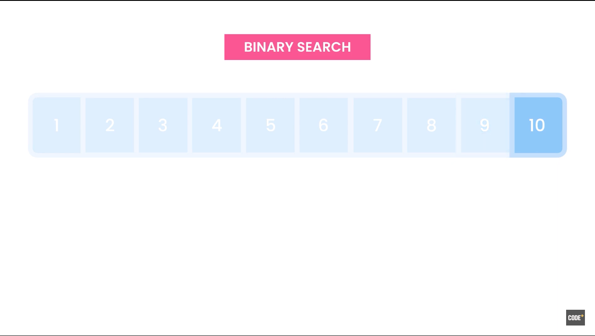

# Logarithmic Growth O(log n)

If we compare logarithmic curve with linear curve, we can see that the linear curve grows at the same rate but the logarithmic curve slows down at some point. So, an algorithm that runs in logarithmic time is more efficient and scalable than an algorithm that runs in linear or quadratic time.

### Example:

Let's say, we have an array of sorted number from 1 to 10 and we want to find the number 10.

#### Linear Search

One way to find it is to iterate over this array using a for loop, going forward, until we find the number 10 which is called the Linear Search because it runs in linear time.

In the worst case scenario, if the number we are looking for is at the end of the array, we have to inspect every cell in this array to find the target number. Which means, the more items we have the longer this operation is going to take. So, the runtime of this algorithm increases linearly and in direct proportion with the size of the array.

#### Binary Search

Another way is to use Binary Search algorithm which runs in logarithmic time and much faster than the Linear Search.

Assuming that the array is sorted, we start off by looking at the middle item.

If this item is smaller or greater than the item we are looking for, we can eliminate either half, left or right side of the array respectively.

In this case, 5 is smaller than 10 then our target number must be in the right partition of this array. So, we don't need to inspect any of the items in the left partition and with this we can narrow down our search by half.

Repeating the same steps we are narrowing down our search by half.

With this algorithm, if we have one million items in an array, we can find the target item with a maximum of 19 comparisons.

**Note:** Code examples of this are shown in Trees and Graphs sections.